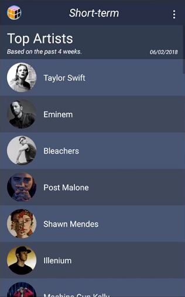
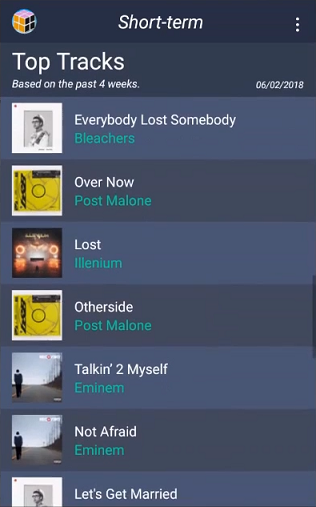
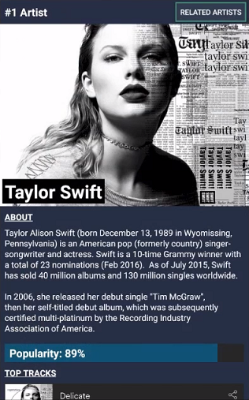
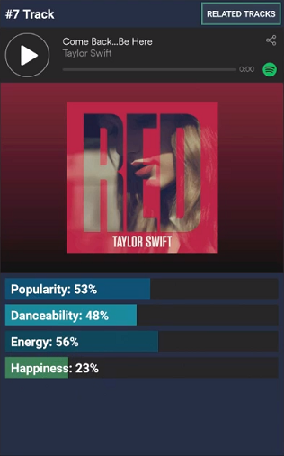
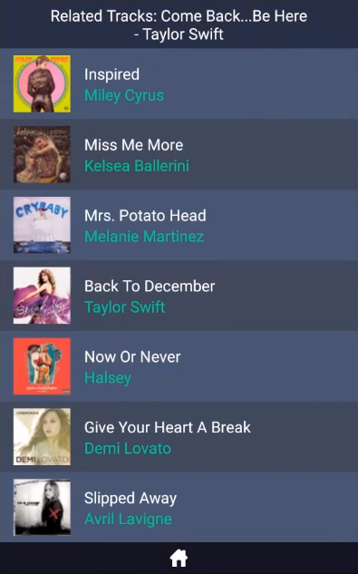

# Topify
Topify is an Android application that allows Spotify users to gain a better understanding of their taste in music.

Video: <a href="https://youtu.be/5zWKFURIrp4" target="_blank">https://youtu.be/5zWKFURIrp4</a>

 

 

 
